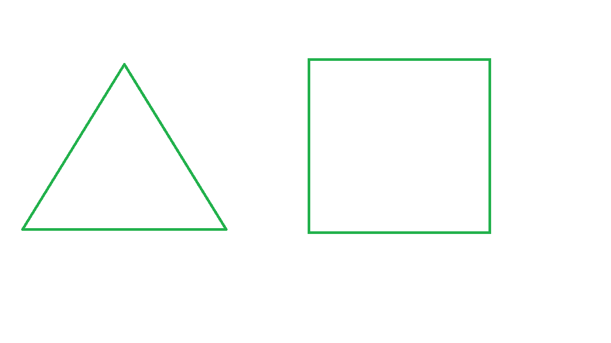
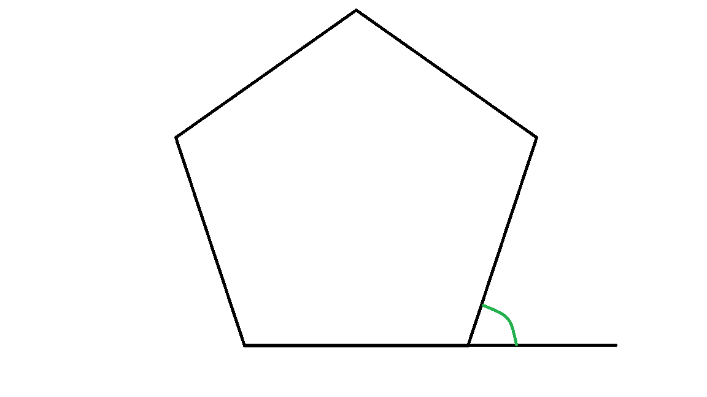

# Challenge

The time has come to put your learning into action!

Create a new script called `Challenge.py` that uses Turtle to draw regular polygons.

<details> <summary> <b> What is a polygon? </b> </summary>

## What is a polygon?

### Polygon

A polygon is a closed 2D shape whose sides are all straight. For example, a right angled triangle or a rectangle but not a semi-circle.


### Regular polygon

A regular polygon is a polygon whose sides are all the same length and angles are all the same size. For example, a square or an equilateral triangle.




### Angles

#### Interior angles

An interior angle of a polygon is the angle between two sides in one corner (or vertex) on the **inside** of the polygon.


#### Exterior angles

An exterior angle of a polygon is the angle made between one side of a polygon and a line extended from another side of the polygon.



#### Facts about interior and exterior angles

- The total of all the interior angles in an $n$ sided polygon equals $(n - 2) * 180$.
- The sum of an interior and an exterior angle of a polygon equals 180.
- The total of all the exterior angles in a polygon equals 360.
- One exterior angle of a regular $n$ sided polygon equals $360 ÷ n$.

</details>

## The challenge

1. The user could input how many regular polygons they want to draw
2. Each regular polygon could:
    - Be drawn...
        - ... in a different location
        - ... at a different angle
    - Have a different...
        - ... pen colour
        - ... pen size
        - ... fill colour
        - ... speed
        - ... size
        - ... number of sides

For example:


## Extension

Turtle has a function for drawing a circle (read more in the [Python Turtle library documentation](https://docs.python.org/3/library/turtle.html#turtle.circle) if you are interested). You give the function a radius and it will draw a circle of the given radius centred radius units to the left of the Turtles current position.

```
t.circle(50) # Draw a circle of size 50
```
You can then use the same customising functions as before to make it different colours, speed etc.

With this new information, can you extend your script to draw some circles as well as polygons?


## Next

Fancy another? [Challenge 2](04-challenge2.md)